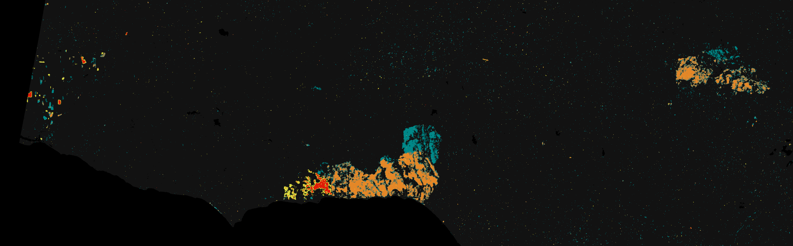

# dist-s1

[](https://pypi.python.org/pypi/dist-s1/)
[](https://pypi.python.org/pypi/dist-s1/)
[](https://pypi.python.org/pypi/dist-s1/)
[](https://anaconda.org/conda-forge/dist-s1)
[](https://anaconda.org/conda-forge/dist-s1)

This is the workflow that generates OPERA's DIST-S1 product. This workflow is designed to delineate *generic* disturbance from a time-series of OPERA Radiometric and Terrain Corrected Sentinel-1 (OPERA RTC-S1) products. The output DIST-S1 product is resampled to a 30 meter Military Grid Reference System (MGRS) tile. Below is a sample product (T11SLT from data acquired January 21, 2025) subset over impacted areas of wildfires in Los Angeles, CA 2024-2025.




## Usage

We have a command line interface (CLI) and python interface. 
All the examples below generate the full sample product above.
We only expose the required paramters below.
See the [examples](examples/) directory for additional parameters available. 
For a description about the organization of the repository see the [Design/Organization of the Repository](#designorganization-of-the-repository) section.
To determine the relevant parameters for `DIST-S1` submission, please see the repository [dist-s1-enumerator](https://github.com/opera-adt/dist-s1-enumerator) and the notebooks within it.

### Python

A variation of the script below can be found in [examples/e2e.py](examples/e2e.py). 
It is possible to run steps of the workflow after the runconfig data has been created (primarily for debugging a step of the workflow).
An example of this step-wise execution can be found in [examples/run_steps.py](examples/run_steps.py).
The same scripts are also found in the [notebooks](notebooks) directory.

```
from pathlib import Path

from dist_s1 import run_dist_s1_workflow

# Parameters for DIST-S1 submission
mgrs_tile_id = '11SLT'  # MGRS tile ID
post_date = '2025-01-21'  # date of recent pass of Sentinel-1
track_number = 71  # Sentinel-1 track number
dst_dir = Path('out')  # directory to save the intermediate and output DIST-S1 product

# Run the workflow
run_dist_s1_workflow(mgrs_tile_id, 
                     post_date, 
                     track_number, 
                     dst_dir=dst_dir)
```


### CLI

#### Main Entrypoint

The main entrypoint mirrors the python interface above and localizes all the necessary RTC-S1 inputs. 

```
dist-s1 run \
    --mgrs_tile_id '11SLT' \
    --post_date '2025-01-21' \
    --track_number 71
```

#### As a SDS Science Application Software (SAS)

See the [examples/sas_run.sh](examples/sas_run.sh) script for an example of how to run the DIST-S1 workflow as a SDS Science Application Software (SAS) with a preparation script to localize the necessary RTC-S1 inputs.

```
dist-s1 run_sas --runconfig_yml_path run_config.yml
```
There sample `run_config.yml` file is provided in the [examples](examples) directory from this prepatory step.

## Installation

We recommend using the mamba/conda package manager and `conda-forge` distributions to install the DIST-S1 workflow, manage the environment, and install the dependencies.

```
mamba update -f environment.yml
conda activate dist-s1-env
pip install dist-s1  # update to conda when it is ready on conda-forge
python -m ipykernel install --user --name dist-s1-env
```

The last 2 commands are optional, but will allow this project to be imported into a Jupyter notebook using the examples in this repository (see below for more details).


### Additional Setup for Localization of RTC-S1 inputs

If you are using the primary workflow that downloads all the necessary RTC-S1 inputs, you will need to create `~/.netrc` file with your earthdata login credentials that can be used at the Alaska Satellite Facility (ASF) data portal to download data. The `netrc`file should have the following entry:
```
machine urs.earthdata.nasa.gov
    login <username>
    password <password>
``` 

### GPU Installation

We have tried to make the environment as open, flexible, and transparent as possible. 
In particular, we are using the `conda-forge` distribution of the libraries, including relevant GPU-drivers.
We have provided an `environment_gpu.yml` which simply adds a minimum version of conda-forge's `cudatoolkit` to the environment to ensure on our systems that GPU is accessible.
This will *not* be installable on non-Linux systems (and maybe even non-Linux systems without GPUs).
The library `cudatoolkit` is the `conda-forge` distribution of NVIDIA's cuda tool kit (see [here](https://anaconda.org/conda-forge/cudatoolkit)).
That said, there could be instances when a new library will introduce a CPU-only version and will break the ability to use GPU on Linux.

To resolve environment issues related to having access to the GPU, we successfully used `conda-tree` to identify CPU bound dependencies.
For example,
```
mamba install -c conda-forge conda-tree
conda-tree -n dist-s1-env deptree
```
We then identified packages with `mkl` and `cpu` in their distribution names.
There may be other libraries or methods of using `conda-tree` that are more elegant and efficient.
That said, the above provides an avenue for identifying such issues with the environment.


### Jupyter Kernel

As noted above, we install the kernel `dist-s1-env` using the environment above via:
```
python -m ipykernel install --user --name dist-s1-env
```
We also recommend installing the jupyter dependencies:
```
mamba install jupyterlab ipywidgets black isort jupyterlab_code_formatter 
```

### Development Installation

As above, we recommend using the mamba/conda package manager to install the DIST-S1 workflow, manage the environment, and install the dependencies.

```
mamba update -f environment.yml
conda activate dist-s1-env
pip install -e .
# Optional for Jupyter notebook development
python -m ipykernel install --user --name dist-s1-env
```


## Docker

### Downloading a Docker Image

```
docker pull ghcr.io/asf-hyp3/dist-s1:<tag>
```
Where `<tag>` is the semantic version of the release you want to download.

Notes: 
- our image does not currently support the `arm64` (i.e. Mac M1) architecture. Therefore, you will need to build the image from the Dockerfile yourself.
- Currently, the image is still under development and we will likely update it to ensure compatibility with GPU processing.

### Building the Docker Image Locally

Make sure you have Docker installed for [Mac](https://docs.docker.com/desktop/setup/install/mac-install/) or [Windows](https://docs.docker.com/desktop/setup/install/windows-install/). We call the docker image `dist_s1_img` for the remainder of this README.

```
docker build -f Dockerfile.cpu -t dist-s1 .
```

### Running the Container Interactively

To run the container interactively:
```
docker run -ti dist-s1
```
Within the container, you can run the CLI commands and the test suite.


# Contribution Instructions

This is an open-source plugin and we welcome contributions and issue tickets. 

Because we use this plugin for producing publicly available datasets, we are heavily reliant on utilizing our test suite and CI/CD pipeline for more rapid development. If you are apart of the OPERA project, please ask to be added to the Github organization so you can create a PR via branch in this repository. That way, you will have access to the secrets needed to run the test suite and build the Docker image. That said, a maintainer can always integrate a PR from a fork to ensure the automated CI/CD is working as expected.


# Design/Organization of the Repository

There are two main components to the DIST-S1 workflow:

1. Curation and localization of the OPERA RTC-S1 products. This is captured in the `run_dist_s1_sas_prep_workflow` function within the [`workflows.py` file](src/dist_s1/workflows.py).
2. Application of the DIST-S1 algorithm to the localized RTC-S1 products. This is captured in the `run_dist_s1_sas_workflow` function within the [`workflows.py` file](src/dist_s1/workflows.py).

These two steps can be run serially as a single workflow via `run_dist_s1_sas_workflow` in the [`workflows.py` file](src/dist_s1/workflows.py). There are associated CLI entrypoints to the functions via the `dist-s1` main command (see [SAS usage](#as-a-sds-science-application-software-sas) or the [run_sas.sh](examples/run_sas.sh) script).

In terms of design, each step of the workflow relies heavily on writing its outputs to disk. This allows for testing of each step via staging of inputs on disk. It also provides a means to visually inspect the outputs of a given step (e.g. via QGIS) without additional boilerplate code to load/serialize in-memory data. There is a Class `RunConfigData` (that can be serialized as a `run_config.yml`) that functions to validate the inputs provided by the user and store the necessary paths for intermediate and output products (including those required for each of the workflow's steps). Storing these paths is quite tedious and each run config instance stores these paths via tables or dictionaries for easier lookup (e.g. by `jpl_burst_id` and acquisition timestamp).

There are also important libraries used to do the core of the disturbance detections including:

1. [`distmetrics`](https://github.com/opera-adt/distmetrics) which provides an easy interface to compute the disturbance metrics as they relate to a baseline of RTC-S1 inputs and a recent set of acquisition data.
2. [`dist-s1-enumerator`](https://github.com/opera-adt/dist-s1-enumerator) which provides the functionality to localize the necessary RTC-S1 inputs.
3. [`tile-mate`](https://github.com/opera-calval/tile-mate) which provides the functionality to localize static tiles including the water mask.

These are all available via `conda-forge` and maintained by the DIST-S1 team.


# Delivery Instructions

There are certain releases associated with OPERA project deliveries. Here we provide instructions for how to run and verify the DIST-S1 workflow.

We have included sample input data, associated a Docker image via the Github registry, and run tests via github actions all within this repository.

```
docker pull ghcr.io/opera-adt/dist-s1
```
If a specific version is required (or assumed for a delivery), then you use `docker pull ghcr.io/opera-adt/dist-s1:<version>` e.g.
```
docker pull ghcr.io/opera-adt/dist-s1:0.0.4
```
The command will pull the latest released version of the Docker image. To run the test suite, run:
```
docker run ghcr.io/opera-adt/dist-s1 bash -l -c 'cd dist-s1 && pytest tests'
``` 

# Checking if DIST-S1 Products are Equal

The final DIST-S1 product consists of a directory with GeoTiff and a png browse image.
Here, here we define equality of products if the generated products contain the same numerical arrays (within the GeoTiff layers), are georeferenced consistently, and utilized the same inputs.
It's worth noting that even if the arrays within the GeoTiff layers are the same, the product directories will have different names due to the differences in processing time (which is a token in the product name).
Similarly, there are some gdal tags that reference local file systems and so will be different between identical products depending on where they were generated.
All that said, the notion of equality may evolve as the product becomes more structured.
Below is an example of how to check if two products are equal within python.
```
from dist_s1.data_models.output_models import ProductDirectoryData

product_1 = ProductDirectoryData.from_product_path('path/to/product_1')
product_2 = ProductDirectoryData.from_product_path('path/to/product_2')

product_1 == product_2
```
Warnings will be raised regarding what data is not consistent between the two products.


